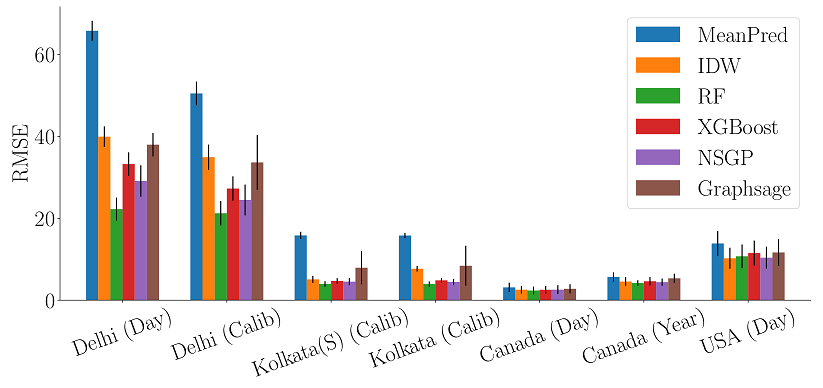

# Kolkata Pollution Dataset Interpolation & Forecasting Benchmarking

We use this repository for various algorithms and methods used to analyze the Kolkata pollution data available at 
https://www.cse.iitd.ac.in/pollutiondata/kolkata

### Datasets benchmarked

Kolkata Dataset: https://www.cse.iitd.ac.in/pollutiondata/kolkata

Delhi Dataset: https://www.cse.iitd.ac.in/pollutiondata/delhi

Canada Dataset: http://www.mdpi.com/2306-5729/4/1/2/s1 (via https://www.mdpi.com/2306-5729/4/1/2)

USA Dataset: https://github.com/mayukh18/DEAP/blob/main/city_pollution_data.csv

### Algorithms benchmarked

We use the following algorithms for analysing the properties and complexity of the datasets.

**_(a) Mean Predictor_** is the simple mean value of all known samples is used as the value of the unknown locations. It is implemented in `graphsage.py`.

**_(b) Inverse Distance Weighting (IDW)_** uses the weighted average value of all known samples factoring the distance as the value of the unknown locations. It is implemented in `baselines.py`.

**_(c) Random Forest (RF)_** is a non-linear model capable of modeling complex spaces. It is known to perform efficiently on non-linear regression tasks, using an ensemble of multiple decision trees, taking the final output as the mean of the output from all trees. It is implemented in `baselines.py`.

**_(d) XGBoost (XGB)_** iteratively combines the results from weak estimators. It uses gradient descent while adding new trees during training. It is implemented in `baselines.py`.

**_(e) ARIMA_** or Auto-Regressive Integrated Moving Average is a statistical time-series forecasting model that uses linear regression. 
It is configured using parameters (_p,d,q_) as: 
_p_ is the number of lag observations included in the model, 
_d_ is the number of times raw observations are differenced, 
and _q_ is the size of the moving average window. We use ARIMA with parameters (3, 1, 1). It is implemented in `arima.py`.

**_(f) N-BEATS_** is Neural Basis Expansion Analysis for Time Series, a deep learning model for zero-shot time-series forecasting. We use the code from Python library "Darts". It is implemented in `nbeats.py`.

**_(g) Non-Stationary Gaussian Process (NSGP)_** is a gaussian processes which learns a non-stationary covariance for latitude and longitude and locally periodic covariance for time. 
It is implemented in `nsgp` directory with reference code from https://github.com/patel-zeel/AAAI22/tree/main/nonstat_gp_cat.

**_(h) Graphsage_** is a graph neural network model to learn and predict values at unknown spatio-temporal locations. It requires the data to be converted to graph before applying the Graphsage model. Both the graph creation and graphsage based analysis is implemented in `graphsage.py`.

### Benchmarking Modes

In different algorithms, we use the `locid`variable to control the datasets (and usable mode) being used.

`0` enables the Delhi dataset benchmarking for Nov 12, 2020 to Jan 30, 2021

`1` enables the Canada dataset benchmarking for 10 days from 2015.

`2` enables the Canada dataset benchmarking for 2006 to 2016.

`3` enables the USA dataset benchmarking for Jan 1, 2019 to Dec 11, 2020.

Also, by default the algorithms work for `fold=0`, the other folds need to specified through command line arguments. 

### Interpolation performance over different datasets

The Calib in X-axis labels denote experiments with the calibrated data. For Kolkata, (S) denotes static LCS data and both Static+Mobile data otherwise.

