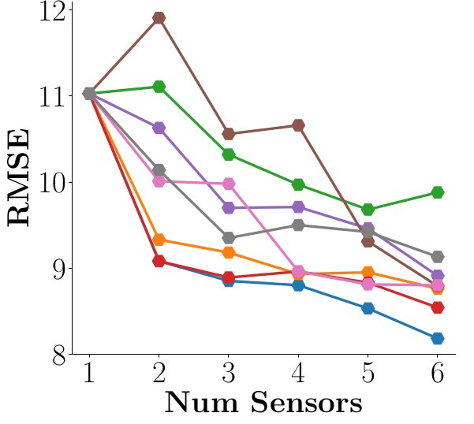

## Pollution Sensor Recommendation

Run as ``python -m src.main`` for RLselect based sensor placement.

Run as ``python -m src.main --baseline=<baseline_name>`` for existing baselines based sensor placement.

``<baseline_name>`` can be among random, bwcentrality, degree, pagerank, maxerr, coverage, lerner, mi

Other config parameters can be explored under the args.debug flag in main.py

### Prerequisites

pip install numpy pandas torch scikit-learn 

Create the folders _**out**_ and **_models_** in the base directory.

## Benchmarking Algorithms

* **_RLselect_**: We designed a novel active learning based algorithm to utilize Reinforcement Learning (RL) in
optimal sensor selection.
* **_Mutual Information (MI)_** [Guestrin et al., 2005; Krause et al., 2008]: This algorithm considers mutual
information as a function of entropy between selected and remaining locations. It aims to recommend
locations which maximizes the overall mutual information. It uses covariance between any pair of
location to find entropy, which limits the usage of this algorithm over a single temporal dimension to
generate data series for each location.
* **_Lerner’s_** [Lerner et al., 2019]: This algorithm was originally devised for heterogeneous sensors and
recommends the central locations with more selection pool locations in the adjacent neighbourhood.
* **_Coverage_** [Agarwal et al., 2020]: This method selects the sensor locations such that maximum area
of the city is covered. The coverage can be maximized in spatial or spatiotemporal settings. As a
functional low-cost static sensor is expected to provide PM data continuously, we focus on the spatial
coverage in our experiments.
* **_MaxError_** [Patel, 2021]: This method utilizes an active-learning framework wherein the sensor
with the highest likelihood of minimizing the overall prediction error, measured through Root Mean
Squared Error (RMSE), is chosen iteratively.
* **_Centrality_** [Freeman, 1977]: The betweenness centrality of a node v is defined as the fraction of
shortest paths between all pairs of nodes in the graph that pass through v.
* **_PageRank_** [Brin and Page, 1998]: In PageRank, nodes that are linked to by other important nodes
receive higher scores, reflecting their centrality in the network. This concept has been widely adopted
beyond web page ranking and is applied in various fields to measure the importance of nodes in
different types of networks.
* **_Random_**: We randomly select location nodes from the selection pool. It represents the most naïve yet
a powerful selection policy.

### Benchmarking Performance

